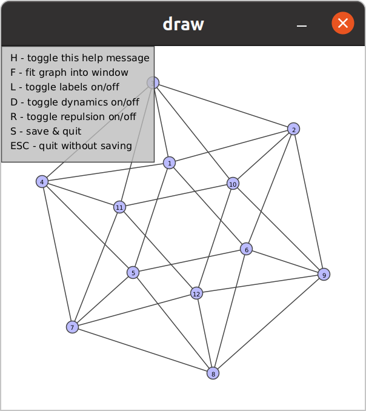

# Welcome to YAGS

YAGS - Yet Another Graph System  
Copyright (C) 2025 C. Cedillo, R. MacKinney-Romero, M.A. Pizaña, I.A. Robles, R. Villarroel-Flores and D. López.

This program is free software distributed under GPLv3.  For details,
see http://www.gnu.org/licenses/gpl-3.0.html.

# What is YAGS?

YAGS - Yet Another Graph System is a [GAP](http://gap-system.org/)
package for dealing with graphs, in the sense of Graph Theory (not bar
graphs, pie charts nor graphs of functions).  Hence our graphs are
ordered pairs G=(V,E), where V is a finite set of vertices and E is a
finite set of edges which are (ordered or unordered) pairs of
vertices.

Snapshots and its official webpage is [here](http://xamanek.izt.uam.mx/yags/).

An online cheatsheet can be found [here](https://github.com/yags/cheatsheet/blob/master/cheatsheet-yags.org).

# Installing YAGS

If you are fond of git, and you already installed GAP, then you could
clone our repository as usual (here we assume that `GAP-DIR` is your GAP
installation directory):

    git clone http://github.com/yags/yags.git GAP-DIR/pkg/yags

Otherwise, you may follow these installation instructions:

  1. Install [GAP](http://www.gap-system.org/).

  2. Obtain YAGS [here](http://xamanek.izt.uam.mx/yags/yags.zip)
     or [here](https://github.com/yags/yags/archive/v0.0.6.zip).

  3. Unpack YAGS: the contents of the zip file should go under
     `GAP-DIR/pkg/yags/`. Here, we assume that `GAP-DIR` is your GAP
     installation directory.

  4. (Optional) Install a Java runtime 
    environment to enable the GUI graph visualizer.
    &YAGS; supports Java versions 8 and newer. You can 
    verify your current Java version with the command: java --version,
    and install Java using: sudo apt install default-jre on Debian-based systems (such as Ubuntu).

  5. Test YAGS by running GAP, loading YAGS and executing a few basic
     commands in a terminal:
     
         > gap  
         --- some GAP info here ---  
         gap> LoadPackage("yags");
         Loading  YAGS - Yet Another Graph System 0.0.6.
         Copyright (C) 2025 by the YAGS authors; for details type: ?yags:authors
         This is free software under GPLv3; for details type: ?yags:copyright  
         true  
         gap> CliqueNumber(Icosahedron);NumberOfCliques(Icosahedron);  
         3  
         20  
         gap> Draw(Icosahedron);

  

    
  

  6. (Optional) Make us happier by sending us a brief installation
  notification to yags@xamanek.izt.uam.mx and subscribing to
  [YAGS distribution list](http://xamanek.izt.uam.mx/yagsnews/).

Did it work? Congratulations! Otherwise, consider the following
troubleshooting issues:

  * Is GAP working?    
    Make sure it is. Follow carefully GAP's installation and
    troubleshooting procedures.
  
  * Is the installation directory correct?  
    The GAP's installation directory, `GAP-DIR`, is typically something
    like `/opt/gap4r8/` (in MS Windows it may look like `C:\gap4r8\`).  If
    this is the case, the YAGS's installation directory, `YAGS-DIR`, is
    `/opt/gap4r8/pkg/yags/` (in MS Windows, it would be
    `C:\gap4r8\pkg\yags\`).  Then, the full path for YAGS's info file
    `PackageInfo.g` should be `/opt/gap4r8/pkg/yags/PackageInfo.g` (or
    `C:\gap4r8\pkg\yags\PackageInfo.g`).
    The installation

  * Are you using GRAPE?  
    GRAPE and YAGS are incompatible: they can not be loaded at the
    same time. If you had an initialization file that loads GRAPE
    automatically, you should disable it in order to use
    YAGS. Alternatively, the command `gap -r` starts GAP disabling any
    user-specific configuration files.

  * Unauthorized to access GAP's directories?  
    The installation procedure above assumed that you have full access
    to your computer (i.e. that you are the root of the system or that
    you are using your PC or Mac). If this is not the case, you can also
    install YAGS under your user directory. For instance, if your user
    directory is `/home/joe/` then you can create a subdirectory
    `/home/joe/.gap/` and hence your YAGS's installation directory
    will be `/home/joe/.gap/pkg/yags/`. Then you can start GAP using
    `gap -l ";/home/joe/.gap"` so that GAP knows where your YAGS is.

# Citing YAGS

If you publish a result and you used YAGS during your research, please
cite us as you would normally do with a research paper:

[CMPRV18]  Cedillo, C., MacKinney-Romero, R., Pizaña, M. A., Robles, I. A., Villarroel-Flores, R. and López D.,   
YAGS, Yet Another Graph System, Version 0.0.6 (2025), (GAP package),
http://xamanek.izt.uam.mx/yags/.   

@misc{YAGS0.0.6,
  author = {Cedillo, C. and MacKinney-Romero, R. and Piza{\~n}a, M. A. and Robles, I. A., Villarroel-Flores, R. and López D.},   
  title  = {{YAGS}, Yet Another Graph System, {V}ersion 0.0.6},
  month  = {Jun},  
  year   = {2025},  
  note   = {GAP package},  
  howpublished = {\href{http://xamanek.izt.uam.mx/yags/}},  
  keywords = {graph; graph theory; clique; clique graph; graph morphism; backtracking},  
  printedkey =  {CMPRV16}  
}

Several other citation formats can be obtained from the file
`YAGS-DIR/CITATION` or by typing `Cite("yags");` at the GAP prompt.

# More Information

More information about YAGS can be found on its [official web
page](http://xamanek.izt.uam.mx/yags/) and manual, which is available
in [html](http://xamanek.izt.uam.mx/yags/doc/) and
[pdf](http://xamanek.izt.uam.mx/yags/yags-manual.pdf) formats.

You can receive notifications about YAGS (i.e. new releases, bug
fixes, etc.) by subscribing to its email [distribution
list](http://xamanek.izt.uam.mx/yagsnews/).

If you are a developer, you may contribute to our project on our
[public repository](https://github.com/yags/yags/).

Comments, support requests, bug reports and installation notifications
are welcome at yags@xamanek.izt.uam.mx.
